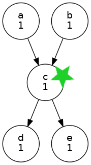
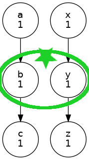
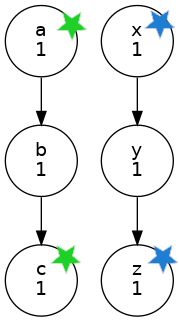
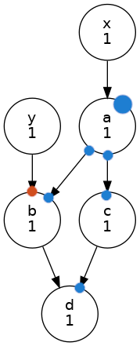
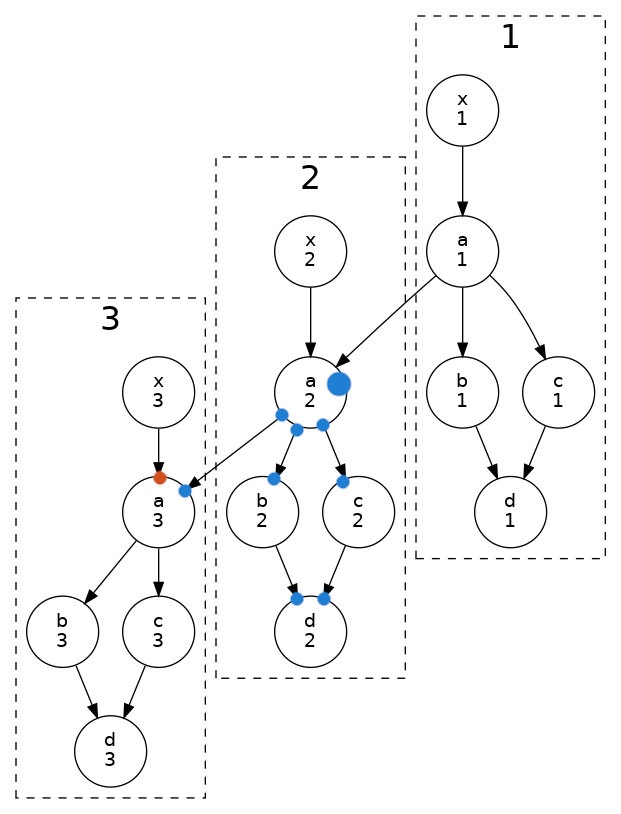

# Workflow-driven DR failover with Cylc 8

**(Table of Contents: See dropdown menu above right.)**

## The Problem

I need to (re)start cycling workflows mid-run on a remote Disaster Recovery
(DR) platform. We should rerun as little as possible after failover, to get
back on schedule quickly.

The workflows generate and consume a lot of data, and there is significant data
transfer latency between sites.

Solutions involving workflow-independent disk sync have inherent problems:
- How to ensure disk state is compatible with workflow state at restart?<br/>
- They likely have to copy vastly more data than is needed for the restart. 
- Typically we might try to rewind to the beginning of an earlier cycle point.
  But even that could fail, depending on when the disaster occurs. To be safe
  we might have to rerun an entire forecast cycle, or more, which is slow and
  expensive.

## A Workflow-driven Solution

Potential workflow (re)start points depend on workflow manager capabilities.

With Cylc 8 we can trigger a flow anywhere in the graph. This allows a
workflow-driven failover solution with no need to modify or checkpoint
the main workflows. We just have to ensure that workflow- and disk-states
are compatible at start up - i.e., that the input data is in place for all
tasks involved in (re)starting the flow.


### Overview

Choose convenient [sync points](#sync-points) in each workflow.
 - The more sync points, the less re-running of tasks after failover.
    - (Start with a few, automate, then add more as desired.)
 - At sync points, explicitly transfer associated restart data to the other platform.
    - (The data must be positioned as if it had been generated by the workflow.)
    - (This could be done during transfer, or later during failover.)
 - Once data transfer completes, record that this sync point is ready if needed.
    - (Update a database or a config file on the other platform, to say that.)

### The Sync Workflow

To avoid modifying the main workflows we can make a separate *sync workflow*
whose tasks trigger off of the main workflow sync points. It could be
auto-generated from a configuration file that records, for each sync point:
- When to trigger the associated data sync task.
- What is needed to (re)start the flow there.

### Failover Restart

If failover is needed, on the other platform, run a script that loops over the
workflows and (re)starts each at its most recent sync points.

At a bottleneck in a workflow, (re)start might be as simple specifying one
[start task](#start-tasks) but you may also need to handle
 - [off-flow prerequisites](#off-flow-prerequisites)
 - [parentless tasks](#parentless-tasks)
 - [initial prep tasks](#initial-prep-tasks)


## Sync Points

Choose sync points with an understanding of the graph. They should be at
bottlenecks, if possible, to simplify data transfer and start-up logic.

### bottlenecks

<table>
<tr>
<td align="left">
  <!-- spacer for full width table! -->
Trigger the flow at c.<br/>
<code>a & b => c => d & e</code>
</td>
<td align="center">
  <!-- spacer for full width table! -->

</td>
</tr>
</table>

A sync point could be defined where task `c` starts running (copy its input data
over for restart at `c`); or where task `c` succeeds (copy its output over for 
restart at `d` and `e`); or both.

Which is preferred may depend on how expensive `c` is to run. If `c` already finished
at the main site, the later sync point would avoid rerunning it on failover.

### spread

Sync points can be spread over concurrent graph paths:
<table>
<tr>
<td align="left">
  <!-- spacer for full width table! -->
Trigger the flow at (b, y)<br/>
<code>a => b => c
x => y => z 
</code>
</td>
<td align="center">
  <!-- spacer for full width table! -->

</td>
</tr>
</table>

### spread, independent

Even independent sync points on different graph paths can work, with
appropriate start-up logic:

<table>
<tr>
<td align="left">
  <!-- spacer for full width table! -->
Trigger the flow at the most recent sync point on each path:
(a or c) and (x or y).<br/>
<code>a => b => c
x => y => z
</code>
</td>
<td align="center">
  <!-- spacer for full width table! -->

</td>
</tr>
</table>

## Off-flow Prerequisites

Off-flow prerequisites represent dependence on tasks that are not strictly
downstream of the trigger points (this may include dependence on tasks in
a previous cycle). They must be artificially satisfied to avoid stalling
the workflow.

<table>
<tr>
<td align="left">
  <!-- spacer for full width table! -->
<p>
If I trigger a flow at <code>a</code> the workflow will stall waiting
on off-flow prerequisite <code>y => b</code>.<br/>

To prevent the stall:
- use `cylc set` to artificially satisfy the prerequisite
- (**Coming in Cylc 8.5** group trigger - of <code>a, b,</code> and
   <code>c</code> at once - will automatically satisfy off-group prerequisites.)
</p>
</td>
<td align="center">
  <!-- spacer for full width table! -->

</td>
</tr>
</table>

## Start tasks

When starting a flow from scratch, such as for failover, it may be better to
specify "start tasks" for the start-up, rather than to manually set or trigger
tasks after start-up: `cylc play --start-task=ID1 --start-task=ID2 ...`.

At start-up, dependence on cycle points prior to the earliest start task will
be ignored. (If you have multiple cycling intervals you may still need to use
`cylc set` to satisfy some off-flow prerequisites).

## Parentless Tasks

It is the completion of upstream (parent) outputs that normally tells Cylc
when to spawn dependent tasks into the active window.

Cycling workflows, however, often have parentless tasks at the top of each cycle.
(See task `x` in the example below). These must be automatically and continually
spawned out to the runahead limit. 

In a normal start from the beginning of the graph, Cylc automatically spawns the
first instance of any parentless tasks, to bootstrap this process.

For triggering a new flow in the middle of the graph though, you must explicitly
trigger an instance of any parentless task because Cylc can't know exactly which
should be the first instance to start from. (In fact it's possible that you only
want to run a sub-graph that dead-ends without continuing to future cycle points).

Use `cylc set --pre=all` spawns tasks (including parentless tasks) into the active
window (with all task-prerequisites satisfied) to begin checking on any xtriggers.

<table>
<tr>
<td align="left">
  <!-- spacer for full width table! -->
<p>
If I trigger a flow at <code>2/a</code> the workflow will stall waiting
on off-flow prerequisite <code>3/x => 3/a</code>.<br/>

To prevent the stall:
- artificially satisfy the off-flow prerequisite with `cylc set`
- use `cylc set --pre=all //3/x` to spawn the first instance of `x`

Alternatively:
- trigger the flow at <code>2/x</code> instead of <code>2/a</code>
- use `cylc set` on the now off-flow prerequisite <code>1/a => 2/a</code>

</p>
</td>
<td align="center">
  <!-- spacer for full width table! -->

</td>
</tr>
</table>

## Initial Prep Tasks

If your workflow graph begins with tasks that (e.g.) prep the workspace and
build or deploy code for the other tasks, you may need to run these again
before starting the flow at the sync point.
(See task `prep` in the example below).

To do this:
 1. start the workflow paused, so that start tasks don't run yet
 2. hold the waiting start tasks, then resume (unpause) the workflow<br/>
    (note also, since 8.4 we can trigger tasks in a paused workflow)
 3. manually trigger the initial prep task(s):
    - if just one prep task, trigger it with `--flow=none` to avoid flow-on
    - else hold tasks downstream of the prep pipeline to avoid flow-on,
       and remove the held tasks once the flow reaches them
 4. once the prep task(s) finish, release (unhold) the start tasks

## Generic Aspects

This section briefly covers several more generic aspects of the DR problem.
These are relatively easy to achieve one way or another and don't require
a lot of specialist Cylc knowledge.

### Updating Workflow Configs on the Remote Platform

Options include:
  - (re)copy them over with each sync point transfer
    - this guarantees compatibility with the sync point restart data
  - (re)deploy them, e.g. via a dev-ops pipeline, before bringing up the remote system
    - small risk of failure due to changes deployed since the last sync
  - whenever they are (re)deployed on one system, deploy them on both systems
    - ditto: small risk of failure due to changes deployed since the last sync

### Fail-back

The DR system must also run the sync workflow, to transfer data ready for eventual
fail-back.

### Housekeeping

To avoid endless accumulation of sync point data, we could automatically delete old
sync point data after each new transfer completes.

(Note the housekeeping tasks within each workflow might take care of old data too,
but not until the system has been brought up).


## An example


This example shows how to start a workflow at an arbitrary sync point,
illustrating the issues discussed above (we assume sync point data has
been copied into place first).

**TODO: more comprehensive example(s).**

Sync point:
- I can start from `2/a`, `2/x`, and `3/data`
- I need the start-up task `1/prep` to run first

1. start paused, with the start tasks in the pool waiting
```console
$ cylc vip --pause ecx -t //2/a -t //2/x -t //3/data
```

2. resume the workflow after holding the start tasks
```console
$ cylc hold 'ecx//*'
$ cylc play ecx
```

3. run the start-up task without flow-on
```console
$ cylc trigger --flow=none ecx//1/prep
```

4. release the waiting start tasks, to start the flow

```console
$ cylc release "ecx//*"
```


